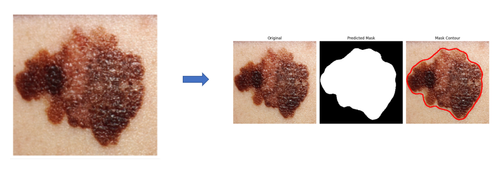
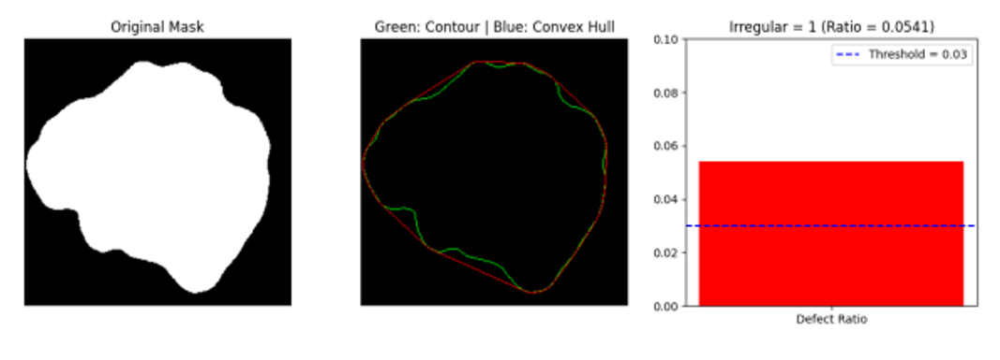
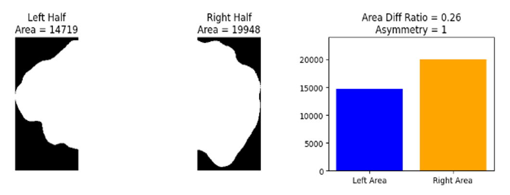
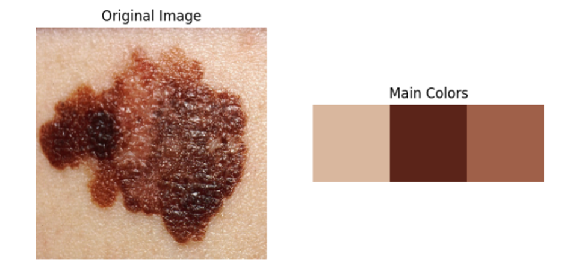
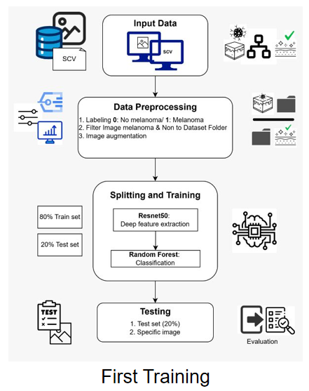
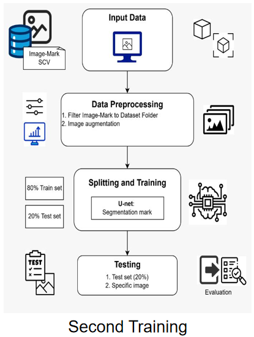

# Melanoma Detection using Deep Learning

<!-- Markdown Markdown Markdown Markdown Markdown Markdown Markdown -->

## Giới thiệu (Overview / Description)

Dự án xây dựng hệ thống phát hiện và phân loại bệnh Melanoma (ung thư da ác tính) từ hình ảnh da bằng các phương pháp Deep Learning và Machine Learning.

Hệ thống được thiết kế theo pipeline gồm nhiều giai đoạn:

- **Segmentation:** sử dụng mô hình **U-Net** để xác định vùng tổn thương trên ảnh da.
- **Feature Extraction:** sử dụng mô hình **ResNet50** để trích xuất các đặc trưng quan trọng từ vùng tổn thương.
- **Classification:** sử dụng thuật toán **Random Forest** để phân loại ảnh thành hai nhóm:
  - Melanoma
  - Non-Melanoma

Mục tiêu của dự án là xây dựng một quy trình hoàn chỉnh từ ảnh đầu vào, phân vùng vùng bệnh lý, trích xuất đặc trưng đến bước dự đoán cuối cùng.

<!-- Markdown Markdown Markdown Markdown Markdown Markdown Markdown Markdown Markdown Markdown Markdown Markdown Markdown Markdown -->

## Demo / Result

### Segmentation Result

### Comparing Edges

### Dividing Half

### Main Colors Extraction

<!-- Markdown Markdown Markdown Markdown Markdown Markdown Markdown Markdown Markdown Markdown Markdown Markdown Markdown Markdown -->

## Dataset

Dự án sử dụng ba nhóm dữ liệu chính phục vụ cho quá trình huấn luyện và đánh giá mô hình.

### 1. Dataset cho Segmentation (U-Net)

- Tổng số: **20.000 ảnh**
- Bao gồm:
  - **10.000 ảnh da gốc (Images)**
  - **10.000 ảnh mặt nạ phân vùng (Masks)**

Dataset được sử dụng để huấn luyện mô hình **U-Net** nhằm xác định vùng tổn thương trên ảnh da.

| Data   | Quantity |
| ------ | -------: |
| Images |   10,000 |
| Masks  |   10,000 |

### 2. Dataset cho Classification (ResNet50 + Random Forest)

- Tổng số: **1.713 ảnh da**
- Được sử dụng để:
  - Trích xuất đặc trưng bằng **ResNet50**
  - Phân loại bằng **Random Forest**

| Data   | Quantity |
| ------ | -------: |
| Images |    1,713 |

### 3. Real-world Dataset (Testing)

- Bao gồm các ảnh tổn thương da thu thập từ nhiều nguồn thực tế.
- Đặc điểm:
  - Không có nhãn
  - Ít được tiền xử lý
  - Đa dạng điều kiện hình ảnh

Dataset này được dùng để đánh giá khả năng tổng quát hóa của mô hình trong môi trường thực tế.

<!-- Markdown Markdown Markdown Markdown Markdown Markdown Markdown Markdown Markdown Markdown Markdown Markdown Markdown Markdown -->

## Cấu trúc thư mục project

### Mô tả các thư mục và file

| File / Folder             | Mục đích                                     |
| ------------------------- | -------------------------------------------- |
| `Data/`                   | Chứa dataset và file CSV chứa thông tin ảnh  |
| `metamelanoma.csv`        | Metadata của bộ dữ liệu Melanoma             |
| `test-results.csv`        | Kết quả hoặc thông tin dữ liệu test          |
| `Data Filter Code/`       | Chứa code xử lý, lọc và chia dữ liệu         |
| `img_filter.py`           | Lọc và tiền xử lý ảnh đầu vào                |
| `img_split_train_test.py` | Chia dataset thành tập train/test            |
| `mix_img.py`              | Trộn hoặc kết hợp dữ liệu ảnh                |
| `Filter.md`               | Tài liệu mô tả quá trình lọc dữ liệu         |
| `Filter_requirement.txt`  | Thư viện cần cho bước xử lý dữ liệu          |
| `Output/`                 | Chứa kết quả sau khi chạy mô hình            |
| `Segmentation.png`        | Kết quả phân vùng vùng tổn thương bằng U-Net |
| `Comparing_edges.png`     | So sánh biên ảnh trước và sau xử lý          |
| `Dividing_half.png`       | Minh họa quá trình chia ảnh                  |
| `Main_colors.png`         | Kết quả trích xuất màu chính trong ảnh       |
| `U-Net.ipynb`             | Huấn luyện và chạy mô hình segmentation      |
| `ResNet50.ipynb`          | Trích xuất đặc trưng bằng ResNet50           |
| `HybridModel.ipynb`       | Pipeline kết hợp ResNet50 + Random Forest    |
| `ABC_features.ipynb`      | Phân tích và xử lý đặc trưng ảnh             |
| `requirement.txt`         | Danh sách thư viện cần cài đặt               |
| `README.md`               | Tài liệu hướng dẫn dự án                     |
| `REFERENCES`              | Chứa tài liệu tham khảo                      |

<!-- Markdown Markdown Markdown Markdown Markdown Markdown Markdown Markdown Markdown Markdown Markdown Markdown Markdown Markdown -->

## Công nghệ sử dụng (Tech Stack)

### Programming Language

- **Python**: Ngôn ngữ chính được sử dụng để xây dựng toàn bộ pipeline xử lý ảnh, huấn luyện mô hình và dự đoán.

### Deep Learning Framework

- **PyTorch**
  - Xây dựng và huấn luyện mô hình **U-Net** cho bài toán Image Segmentation.

- **TensorFlow / Keras**
  - Sử dụng mô hình **ResNet50** để trích xuất đặc trưng hình ảnh.

### Machine Learning

- **Scikit-learn**
  - Sử dụng thuật toán **Random Forest** cho bước phân loại Melanoma.

### Computer Vision & Image Processing

- **OpenCV**
  - Xử lý ảnh, resize, phân tích biên và các thao tác trên ảnh.

- **Pillow (PIL)**
  - Đọc, lưu và xử lý ảnh.

### Data Processing

- **NumPy**
  - Xử lý dữ liệu dạng ma trận và tính toán số học.

- **Pandas**
  - Quản lý dataset, đọc file CSV và xử lý dữ liệu.

### Data Augmentation

- **Albumentations**
  - Tăng cường dữ liệu ảnh (image augmentation) nhằm cải thiện khả năng học của mô hình.

### Visualization

- **Matplotlib**
  - Hiển thị ảnh, kết quả segmentation và phân tích dữ liệu.

<!-- Markdown Markdown Markdown Markdown Markdown Markdown Markdown Markdown Markdown Markdown Markdown Markdown Markdown Markdown -->

## Cài đặt (Installation)

Clone project về máy:
git bash:

- git clone <repository-url>
- cd Melanoma-Detection
  Mở project và terminal của project đó, cài đặt thư viện trong requirements: **pip install -r requirements.txt**

<!-- Markdown Markdown Markdown Markdown Markdown Markdown Markdown Markdown Markdown Markdown Markdown Markdown Markdown Markdown -->

## Cách chạy

- Thay đổi các đường dẫn dữ liệu trong project thành đường dẫn tương ứng trên máy cá nhân.
- Mở các file `.ipynb` và chạy từng notebook theo nhu cầu:
  - `U-Net.ipynb`: chạy mô hình segmentation.
  - `ResNet50.ipynb`: chạy quá trình trích xuất đặc trưng bằng ResNet50.
  - `HybridModel.ipynb`: chạy pipeline kết hợp ResNet50 + Random Forest.
  - `ABC_features.ipynb`: phân tích và xử lý đặc trưng ảnh.

Có thể chạy toàn bộ pipeline hoặc từng bước riêng lẻ tùy theo mục đích sử dụng.

<!-- Markdown Markdown Markdown Markdown Markdown Markdown Markdown Markdown Markdown Markdown Markdown Markdown Markdown Markdown -->

## Pipeline / Workflow

Hệ thống được xây dựng theo pipeline gồm hai giai đoạn chính:

### First Training: Melanoma Classification

Giai đoạn đầu sử dụng mô hình phân loại để xác định loại tổn thương da.

- Input: Ảnh da đầu vào.
- Model: ResNet50 kết hợp với Random Forest.
- Output:
  - Melanoma
  - Non-Melanoma

Mục đích của bước này là xác định nhóm bệnh trước khi thực hiện các bước phân tích tiếp theo.

### Second Training: Lesion Segmentation

Giai đoạn thứ hai tập trung vào phân vùng vùng tổn thương trên ảnh da.

- Input: Ảnh da.
- Model: U-Net.
- Output: Mask nhị phân vùng tổn thương.

Kết quả segmentation được sử dụng để hỗ trợ quá trình trích xuất đặc trưng và phân tích vùng Melanoma.

<!-- Markdown Markdown Markdown Markdown Markdown Markdown Markdown Markdown Markdown Markdown Markdown Markdown Markdown Markdown -->
<!-- Markdown Markdown Markdown Markdown Markdown Markdown Markdown Markdown Markdown Markdown Markdown Markdown Markdown Markdown -->
<!-- Markdown Markdown Markdown Markdown Markdown Markdown Markdown Markdown Markdown Markdown Markdown Markdown Markdown Markdown -->
